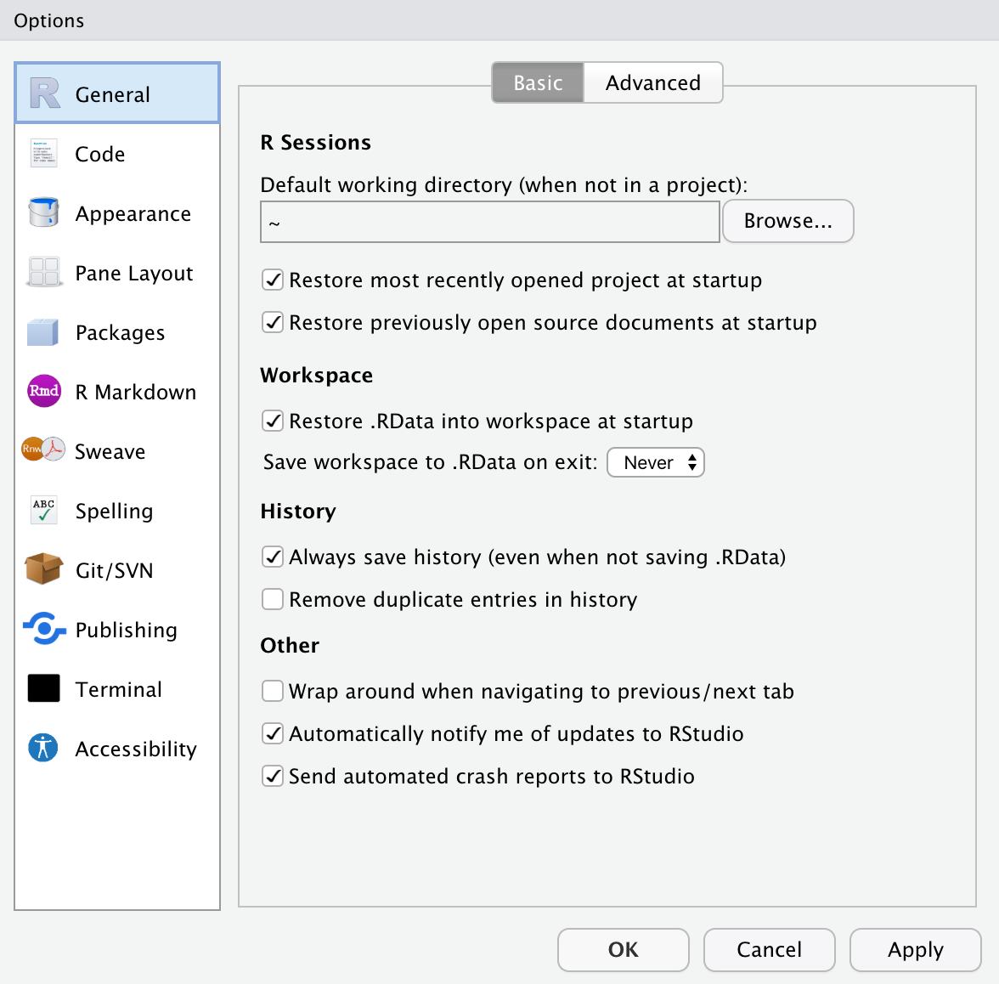

# Introduction to Using RStudio


Open RStudio


## Customizing RStudio

While the information in this section is not crucial for making things work, it is useful to get RStudio looking good and setting some default settings. Open the `Tools > Global Options` menu to access the different options. 

```{r}
#| label: fig-rstudio-options
#| fig-cap: "The RStudio options/preferences menu has many settings to customize RStudio."
#| fig-alt: "The RStudio options/preferences menu has many settings to customize RStudio."
#| echo: false
#| out-width: "50%"


```


- In the `General > Basic` settings, change the option on `Save workspace to .Rdata on exit` to be "Never". Click the "Apply" button.
- In the `Appearance` settings, customize the look of RStudio to something aesthetically appealing to you. When you are finished, click the "Apply" button.
- There are also options you can set in the `Accessibility` settings if you use a screen reader. If you change anything, don't forget to click the "Apply" button.

When you are finished customizing RStudio, click the "OK" button.


<br />
