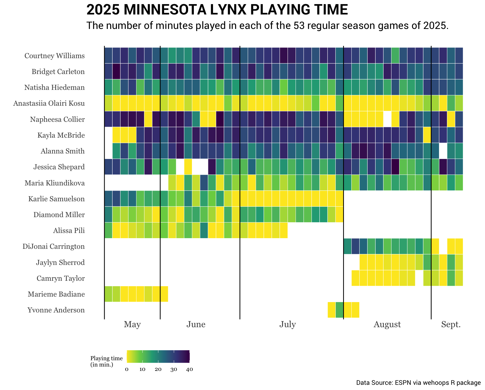

# Color  {#sec-labels}

This chapter will focus on how we improve both the aesthetics and readability of a plot by using color. On its surface, you might think that color is only useful as a way to beautify a plot, and this is one legitimate use of color. The color palette of a plot can certainly make it more appealing to readers. But, color also often acts as a visual cue to readers conveying important information about the data visualization itself. 

<br />

]


### Colorblind

About 8% of men and 1% of women have some form of color impairment. Most people with color deficiencies aren't aware that the colors they perceive as identical appear different to other people. Most still perceive color, but certain colors are transmitted to the brain differently.

The most common impairment is red and green dichromatism which causes red and green to appear indistinguishable. Other impairments affect other color pairs. People with total color blindness are very rare.


<br />


## Exercises: Your Turn {-}

Consider the following data visualization that shows the amount of playing time for each of the Minnesota Lynx players for the 2025 regular season. 

```{r}
#| label: fig-mn-lynx-playing-time
#| fig-caption: "A heatmap showing the amount of playing time for each of the Minnesota Lynx players for the 2025 regular season."
#| fig-alt: "A heatmap showing the amount of playing time for each of the Minnesota Lynx players for the 2025 regular season."
#| out-width: "90%"
#| echo: false


```


1. This visualization does not have a label for either the *x*- or *y*-axis. Explain why this is probably an okay decision for this visulaization.

<button class="solution-btn solution-btn-default" onclick="toggle_visibility('exercise_04-02-01');">Show/Hide Solution</button>

<div id="exercise_04-02-01" style="display:none; margin: -40px 0 40px 40px;">
In this visualization it is fairly obvious from the title and subtitle what the values being plotted on the *x*- and *y*-axis are; players and month. Because of this it isn't strictly necessary to label these axes. 
</div>


2. Write the syntax you would add into the `gf_labs()` function if you were creating this plot using R.

<button class="solution-btn solution-btn-default" onclick="toggle_visibility('exercise_04-01-00-02');">Show/Hide Solution</button>

<div id="exercise_04-01-00-02" style="display:none; margin: -40px 0 40px 40px;">

</div>


Consider the following data from the *umn-bike-amenities.csv* file. 

```{r}
#| label: import-bike-amenities-data
#| message: false

# Import data
bike_amenities <- readr::read_csv("data/umn-bike-amenities.csv")

# View data
DT::datatable(bike_amenities)
```

Imagine that this has been imported into a data object called `bike_amenities`. Also suppose we wanted to create a bar chart of the `campus` attribute, which provides the campus location (East Bank, West Bank, or St. Paul) of the bike amenities in the data.

3. Write out the syntax to create a horizontal bar chart of the `campus` attribute. Also color the bar borders black and fill the bars with yellow. Lastly, add labels to help readers better interpret the plot.

<button class="solution-btn solution-btn-default" onclick="toggle_visibility('exercise_03-01-04');">Show/Hide Solution</button>

<div id="exercise_03-01-04" style="display:none; margin: -40px 0 40px 40px;">

</div>


<br />